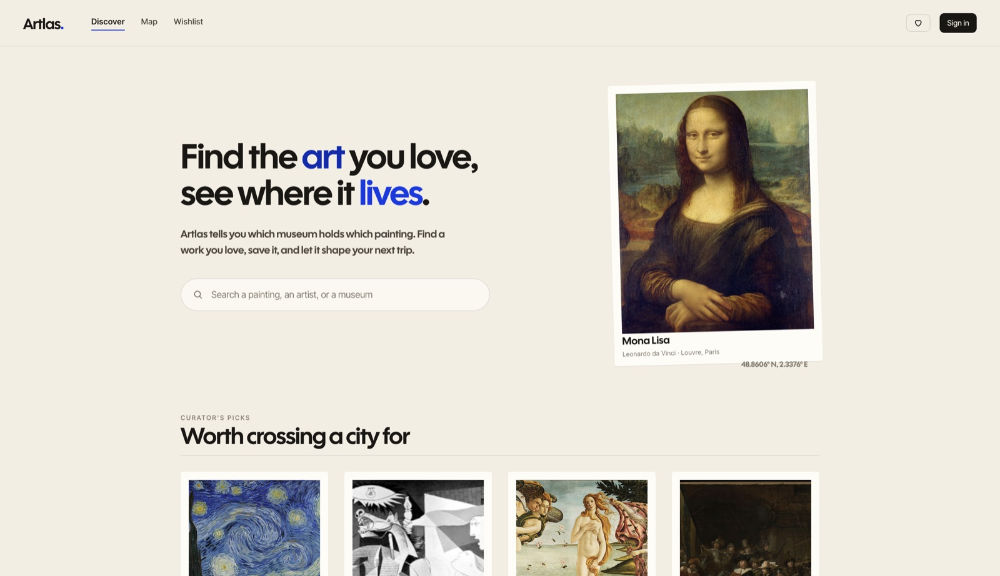
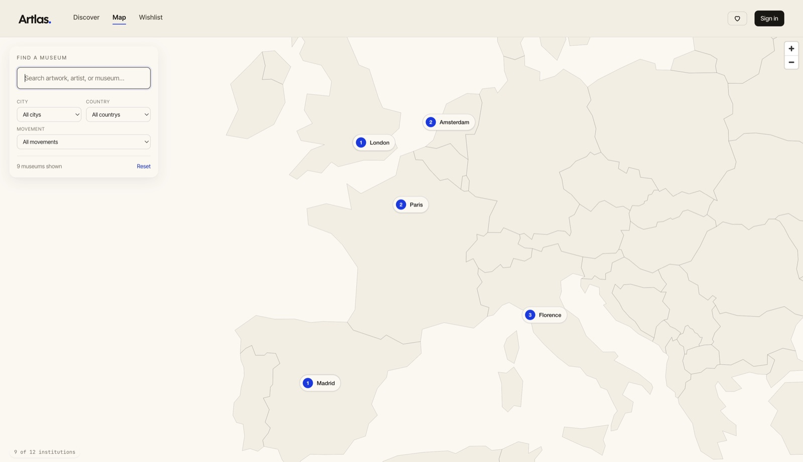
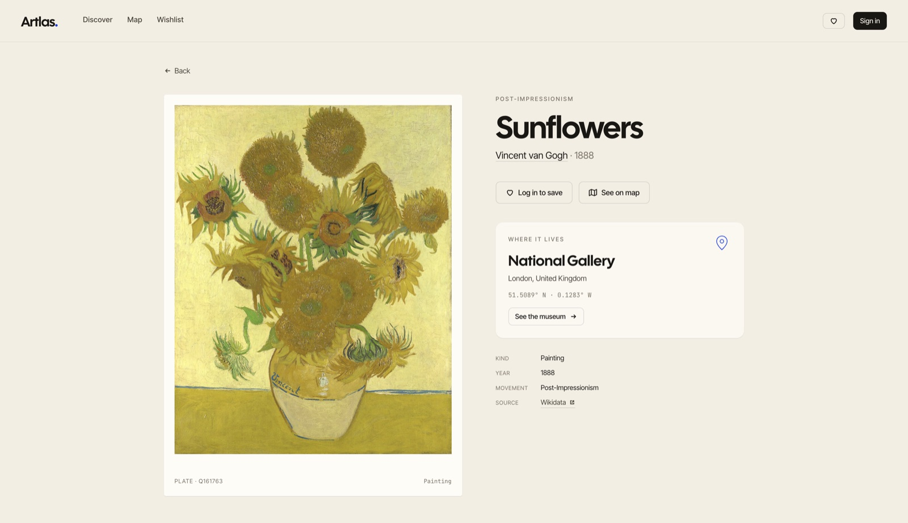
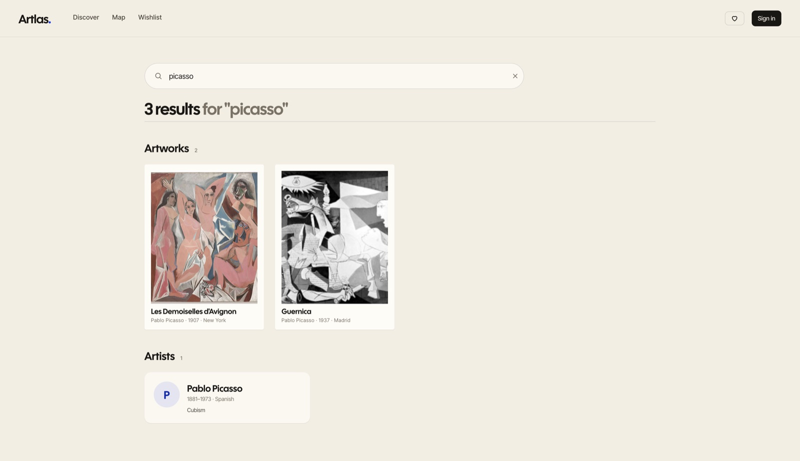
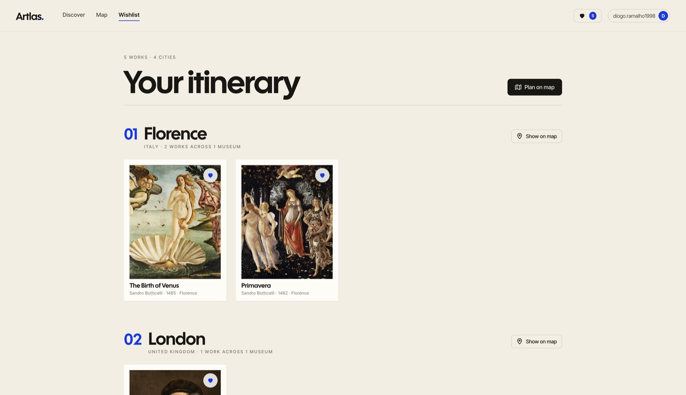
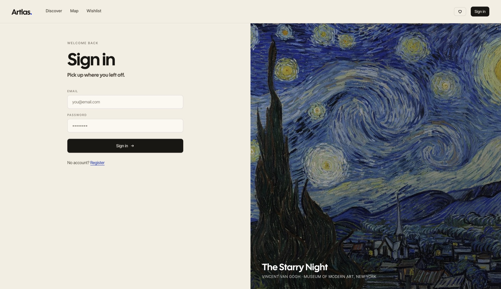

# Artlas

Find where great art physically lives — and plan a trip around it.

Search for an artwork or an artist, see which museum holds the work, save it to a wishlist, and let your saved pieces shape your next city break.



## What it does

- **Search** by artwork, artist, or museum with typo-tolerance (pg_trgm word similarity).
- **Map** every museum in the catalogue, filterable by city, country, or movement. Click a pin to see the works held there.
- **Detail pages** for artworks, artists, and museums — coordinates, related works, "where it lives" cards.
- **Wishlist as itinerary** — saved works are grouped by city so the list reads like a travel plan.
- **Auth + per-user wishlist** — JWT, optimistic UI, route-level guards.

## Screenshots

| | |
|:---:|:---:|
|  |  |
| **Map** — pill markers per museum, side panel with the works held there. | **Artwork detail** — framed image, "Where it lives" card, related works. |
|  |  |
| **Search results** — bucketed by artworks / artists / museums. | **Wishlist** — grouped by city as a numbered itinerary. |
|  | |
| **Login / Register** — split-screen with featured artwork. | |

## Quickstart

You'll need `docker`, [`uv`](https://docs.astral.sh/uv/), and `node` (≥ 20).

```bash
# 1. Postgres in Docker
docker compose up -d postgres

# 2. Backend
cd backend
cp .env.example .env
# Generate a secret: openssl rand -hex 32  →  paste into JWT_SECRET_KEY
uv sync
uv run alembic upgrade head
PYTHONPATH=src uv run python -m etl.seed   # seed dev data (idempotent; --reset to truncate)
uv run uvicorn main:app --reload --app-dir src
# API on http://localhost:8000  ·  docs on http://localhost:8000/docs
```

```bash
# 3. Frontend (in another terminal)
cd frontend
cp .env.example .env
npm install
npm run dev
# http://localhost:5173
```

That's it. Open `http://localhost:5173`, search "starri" or "picaso", click a result, save a few works to the wishlist, navigate to `/wishlist`.

### Full Docker (single command)

```bash
docker compose up --build
```

Brings up Postgres, the FastAPI backend, and the Vite frontend together.

## Tech

| Layer | Choice |
|---|---|
| Backend | FastAPI · async SQLAlchemy 2 · Alembic · Postgres 16 + pg_trgm (+ PostGIS extension enabled, currently unused) |
| Auth | OAuth2 password flow · JWT (HS256, ~60 min) · `pwdlib` + argon2id |
| Frontend | React 19 + TypeScript + Vite · React Router · TanStack Query |
| Map | MapLibre GL with a custom country-fill style (natural-earth GeoJSON) |
| Styling | Tailwind 3 + a small custom design system (Cal Sans / Inter Tight / JetBrains Mono) |
| Tooling | `uv`, `ruff`, `pytest`, pre-commit |

## Project layout

```
artlas/
├── backend/
│   ├── src/
│   │   ├── main.py              # FastAPI app factory
│   │   ├── api/v1/              # routers, endpoints, deps
│   │   ├── core/                # config, security, exceptions, logging
│   │   ├── db/                  # base + async session
│   │   ├── models/              # SQLAlchemy
│   │   ├── schemas/             # Pydantic
│   │   ├── repositories/        # async DB access
│   │   ├── services/            # search ranking + business logic
│   │   └── etl/                 # seed.py, seed_data.py (curated dev fixtures)
│   ├── alembic/                 # migrations
│   └── tests/unit/              # unit tests (services, security, exceptions)
├── frontend/
│   └── src/
│       ├── app/                 # App shell, routes, providers
│       ├── components/          # TopNav, Footer, Icon, SmartImg, BackLink, sections
│       ├── features/<name>/     # one folder per feature: pages, hooks, types
│       ├── lib/                 # api.ts (request wrapper), queryClient
│       └── styles/              # Tailwind layer + custom CSS components
├── docker-compose.yml
└── docs/screenshots/            # screenshots used in this README
```

## Roadmap / known gaps

- **Mobile responsive pass** — the design is desktop-first today.
- **Real Wikidata ETL** — currently seeded from `etl/seed_data.py`. The schema is shaped for a SPARQL → upsert pipeline (every row carries a real `wikidata_id`).
- **Integration tests + CI** — only unit tests are wired today.
- **Wishlist note editing** — the schema supports `notes`, but no UI surfaces them yet.
- **Trip planning beyond grouping** — dates, sharing, exporting are open questions.

## License

MIT.
